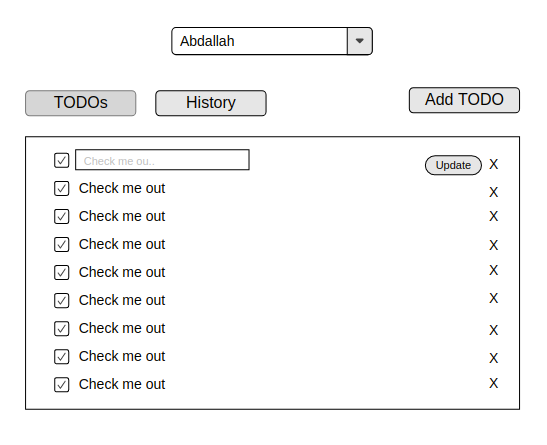
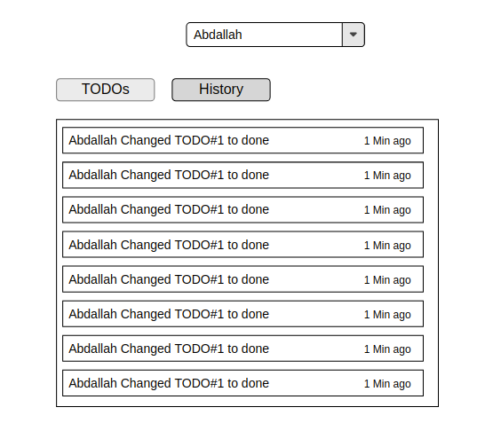

 
 <h1 align="center">Senior Frontend Engineer</h1>

## About the role
We are looking for a Senior Engineer to help in creating performant and large scale applications, working on features improvements and be able to define technical designs and architecture before implementations.

## Task Overview

Imagine we are assigned to monitor some user's todo lists, each user has his todo list which is different from other users. and we have the privileges to create, update or delete items in user's data ( as admins ).

Our task is to create a simple interface to show a dropdown of users and a list to show user's todo items.

Behind the scenes, we have access to the updates history, which means we can switch the view to see this user activity and the history of this user TODOs.

## Acceptance Criteria

- View start point will be showing a dropdown with a placeholder of the select user.
- On selecting user show loader in TODO container while fetching data.
- Show each user TODOs in a container after the dropdown list.
- We can create, update and delete current selected user TODOs.
- Updates should reflect to user TODO's history which means we can see the updates we just did in the history tab.
- We can navigate between users from the dropdown.

## Wireframe

|||
|--|--|

<a href="/images">Better Quality</a>

## Technical Requirments

> We are seeking to hire someone who is skilled using React, TypeScript and can do Unit Testing.

You are not required or stuck to specific technical tools, you can use whatever you want to achieve the task functionalities.

This task is to evaluate your ability to deal with data and managing it.

### Technical Bonuses

- Don't relay on CRA for the project. and create your own boilerplate.
- Solution is following Functional paradigm
- Solution is documented, consistent.
- Solution follows TTD, has tests for UI and functionalities.
- Add CI/CD using any of the free services (CircleCI, Travis).
- Beautiful UI.
- Writing Beautiful README.

## Hints
- Refer to [db.json](/db.json) for demo data you can use or visit [jsonplaceholder.typecode.com](https://jsonplaceholder.typicode.com/) for fake API.
- You can use ContextAPI for managing the state and data logic.
- You can use `useReducer` hook for actions and state updates.
- You can fake-fetching data with `Promises` and `setTimeout` to show loaders for beautiful UI.
- More strong type more error-free solution.
- More test coverage more error-free solution.

Finally, we wish you all of Good Luck.
